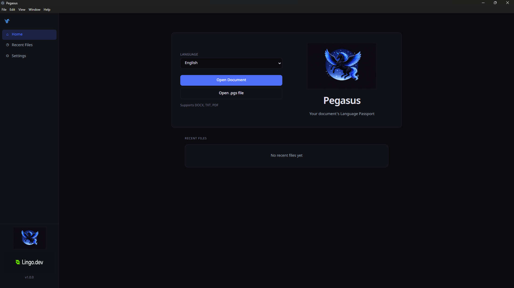
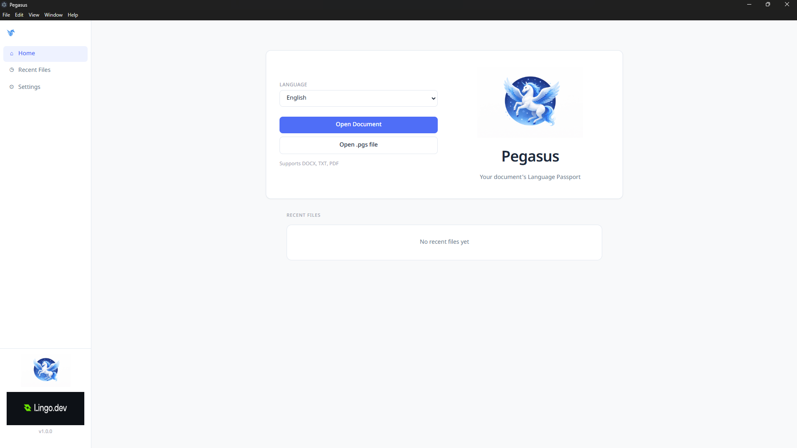
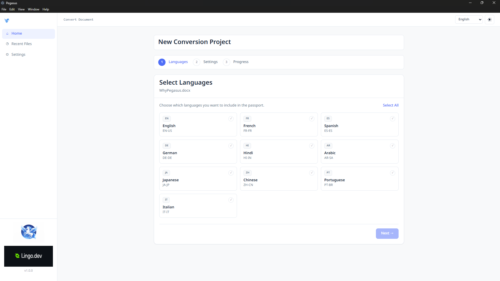

# Pegasus

Pegasus is an desktop app for viewing and translating documents into multilingual `.pgs` Language Passport files.   

Made for Lingo.dev Hackathon 3

## The Problem
You created a document, shared it with someone. Now you have to translate the document in another language because that person requested it. You are maintaining more than 1 instance of same file, just in different languages. Even a small change can create a load of work to be done. This becomes greater as the number of languages increase.

## The Solution
A single file containing all the required translations. A single app that manages this all.

## ScreenShots






## Highlights

- Open `DOCX`, `PDF`, and `TXT` files
- Translate into multiple languages in one run
- Save translations in `.pgs` format for fast reopen/switch
- View `.pgs` content by language (including original)
- Dark/light UI theme
- Localized UI via Lingo.dev Compiler

## Tech Stack

- Electron + React + TypeScript
- Tailwind CSS
- Lingo.dev Compiler (`@lingo.dev/compiler`)
- Lingo SDK runtime translation (`@lingo.dev/_sdk`)

## How Pegasus Works

1. User opens a source file (`DOCX`, `PDF`, `TXT`) or existing `.pgs`
2. Main process extracts chunked text + structure metadata
3. Selected languages are translated chunk-by-chunk
4. Content is reconstructed and saved into a `.pgs` package
5. Renderer displays translated content by selected language

## Prerequisites

- Node.js 20+ (recommended)
- npm 10+

For UI translation (not needed until you made a change in UI) generation (`LINGO_BUILD_MODE=translate`), configure your Lingo compiler API key in environment variables as required by your Lingo.dev setup.

## Setup
```bash
git clone https://github.com/ShivRaiGithub/pegasus.git
cd pegasus
```

```bash
npm install --legacy-peer-deps
```

## Scripts

```bash
# Build main + preload + renderer (default cache-only localization build)
npm run build

# Preview built app
npm run start
```

## Localization Workflow (Lingo.dev)

Pegasus uses Lingo Compiler in the renderer build.

- Source locale: `en`
- Target locales: `fr`, `es`, `de`, `hi`, `ar`, `ja`, `zh`, `pt`, `it`
- Config: `lingo.config.ts`

Build modes:

```bash
# Fast build using existing cache
npm run build

# Force translation generation and update public/translations/*.json (Do this if you did a UI change)
LINGO_BUILD_MODE=translate npm run build
```

Windows PowerShell:

```powershell
$env:LINGO_BUILD_MODE="translate"; npm run build
```

Windows Command Prompt (cmd):

```cmd
set LINGO_BUILD_MODE=translate && npm run build
```

> NOTE: The app was built and tested mostly on WSL (Linux environment). It was tested on windows too up to an extent, but not on iOS.